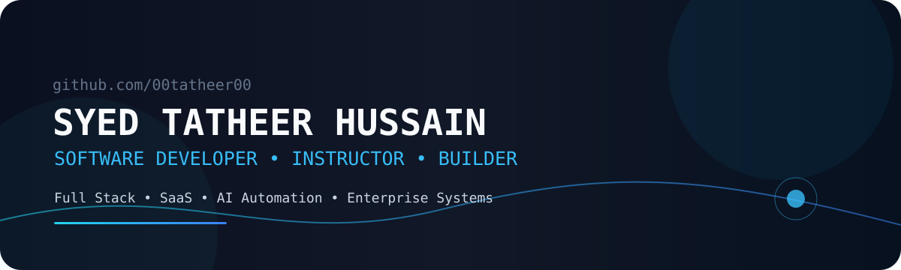
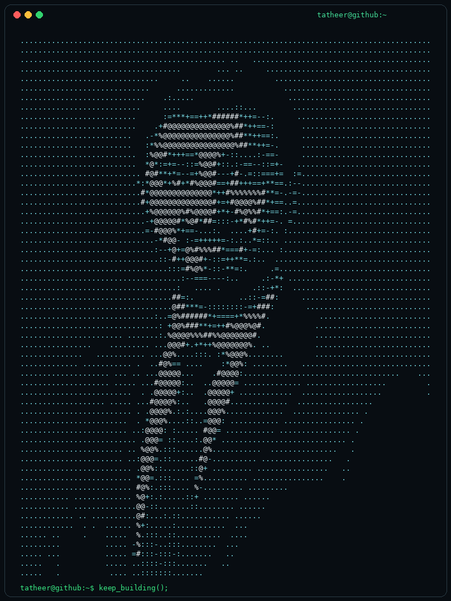
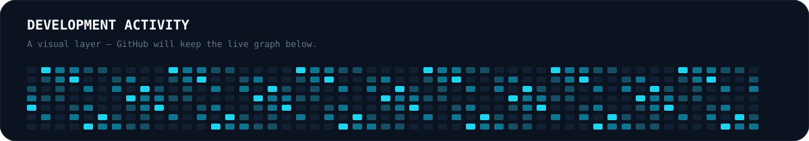

---

## About

**Software Developer · Instructor · Problem Solver · Founder & CEO @ Tech4Edges**

I build modern web applications, SaaS products, enterprise systems, dashboards, APIs, and AI-powered automation. I enjoy taking a real-world problem from **idea → architecture → product → deployment** and making the result useful, maintainable, and scalable.

---

## Tech Stack

---

## Featured Work

### 📦 Wholesale Distributor System
Business-focused distribution management software built around real operational workflows and enterprise requirements.

### 🎓 Student ERP System
A MERN-based ERP for Computer Science faculties covering student management, attendance, courses, GPA, fees, fines, dashboards, and role-based access.

### 🏥 Visitor & Student Management System
A MERN-based visitor platform with digital entry, QR-based student scanning, ID-card generation, and secure tracking.

### 🛒 AVENZON
An enterprise-oriented multi-vendor marketplace project focused on modern e-commerce architecture and scalable application development.

[View all repositories →](https://github.com/00tatheer00?tab=repositories)

---

## GitHub

  

---

## Currently Building

`AI Automation` · `Enterprise SaaS` · `Business Systems` · `Modern Web Apps` · `Developer Education`

### Exploring

`AI Agents` · `MCP` · `Cloud` · `System Design` · `Automation`

---

### Building software. Teaching developers. Automating what matters.

